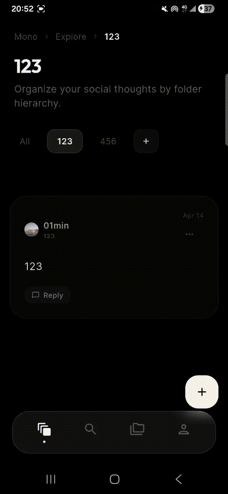
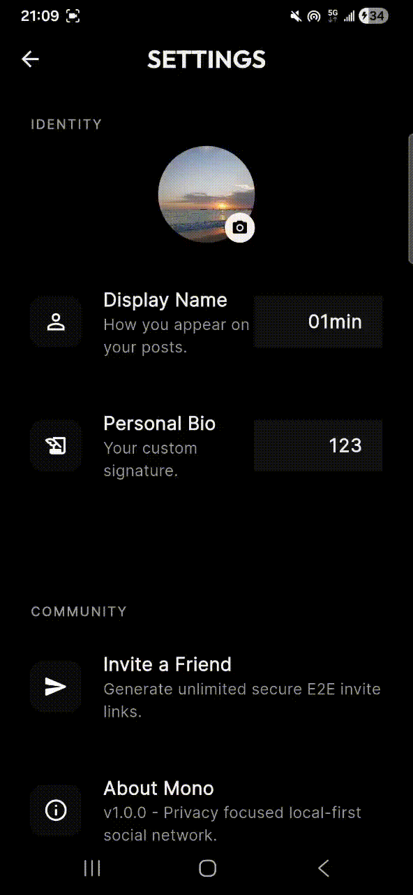
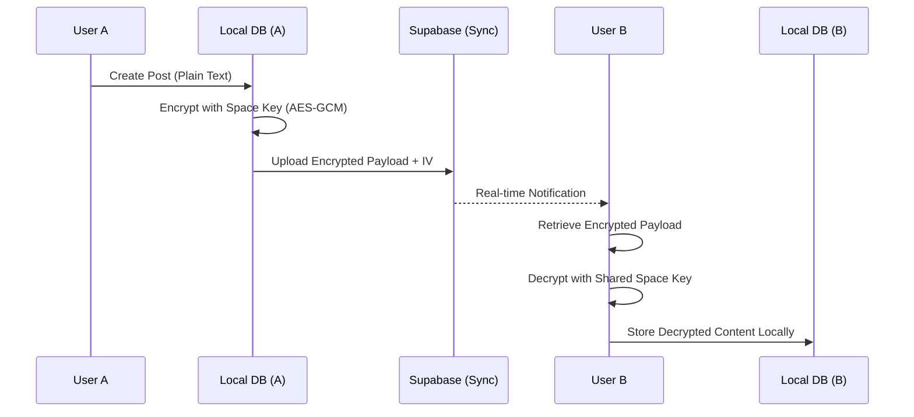

# Mono Project Technical Whitepaper

## Section 1: Project Overview and Strategic Vision

The Mono Project represents a paradigm shift in contemporary social networking architectures, moving away from centralized, data-harvesting models toward a decentralized, privacy-centric, and local-first ecosystem. This technical whitepaper details the architectural decisions, cryptographic protocols, and data persistence methodologies implemented within Mono. 

Mono is engineered to facilitate structured text streaming within an environment that prioritizes user agency and data sovereignty. By integrating hierarchical organizational structures—referred to as "Spaces"—with rigorous end-to-end encryption (E2E), Mono addresses the inherent vulnerabilities of traditional social media platforms, including unauthorized data access, algorithmic manipulation, and the erosion of digital privacy.

### 1.1 Core Objectives
The primary technical objectives of the Mono Project are as follows:
- To implement a "Local-First" data architecture where the primary source of truth resides on the user's edge device.
- To provide robust, mathematically verifiable privacy via industry-standard cryptographic algorithms (AES-GCM).
- To enable seamless, real-time collaboration across multiple devices without compromising the security of the underlying data.
- To offer a superior user experience (UX) characterized by minimal latency, high availability, and premium aesthetic design (Glassmorphism).

---

## 📸 Showcase

| **Flow: Creating Discussions** | **Invite: Shared Communities** |
| :---: | :---: |
|  |  |
| *Visualizing hierarchical depth* | *Real-time sync and invitation* |

[View Full Feature Demonstration on our Official Website »](https://01min.github.io/Mono/)

---

## Section 2: Technological Stack and Framework Analysis

The Mono application is built upon a modern, high-performance technological stack designed for cross-platform compatibility and efficient resource utilization.

### 2.1 Front-end Framework: Flutter and Dart
The choice of Flutter (SDK ^3.10.4) as the core framework provides several architectural advantages:
- **Unified Codebase**: Enables consistent behavior across Android, iOS, and desktop platforms.
- **Skia/Impeller Rendering Engine**: Facilitates complex, high-frame-rate visual effects, including real-time blurs and glassmorphism, with hardware acceleration.
- **Dart AOT (Ahead-of-Time) Compilation**: Ensures near-native performance by compiling source code directly to ARM or x64 machine code.

### 2.2 Local Persistence Layer: Hive NoSQL
Traditional relational databases (SQLite) incur significant overhead for mobile text streaming. Mono utilizes **Hive**, a lightweight, high-performance NoSQL key-value store implemented in pure Dart. 
- **Performance**: Hive is optimized for low-latency read/write operations by maintaining in-memory indexes.
- **Lazy Loading**: Allows for efficient handling of large datasets without exhausting mobile device RAM.
- **Native Encryption**: Supports AES-256 encryption at the persistence layer, ensuring that data at rest is protected even if the physical device is compromised.

### 2.3 Cloud Infrastructure and Backend: Supabase
For optional cloud synchronization and community features, Mono leverages **Supabase**, an open-source Firebase alternative built on top of **PostgreSQL**.
- **Real-time Engine**: Utilizes PostgreSQL's replication functionality to broadcast changes (via WebSockets) to subscribed mobile clients.
- **Storage**: Provides S3-compatible object storage for binary assets (e.g., user avatars).
- **Extensibility**: Facilitates future integration of edge functions for administrative tasks.

---

## Section 3: Local-First Data Persistence Architecture

The "Local-First" principle is the cornerstone of Mono's data architecture. In this model, the local device is the authoritative source of truth.

### 3.1 Hierarchical Data Indexing
Mono organizes information using a tree-based hierarchical structure.
- **Entities**: The two primary entities are `Folder` (Space) and `Post`.
- **Relational Mapping**: Each `Post` is linked to a `Folder` via a unique UUID (`folderId`).
- **Nesting**: `Folders` can contain other `Folders` via parent-child relationships (`parentId`), allowing for unlimited organizational depth.

### 3.2 Secure Persistence Workflow
The data persistence workflow involves multiple layers of security:
1. **Master Key Generation**: Upon the initial execution of the application, a 256-bit cryptographically secure random key is generated.
2. **Secure Vaulting**: This master key is stored within the device's hardware-backed secure enclave using `FlutterSecureStorage` (KeyChain for iOS, KeyStore for Android).
3. **Box Encryption**: All Hive boxes (data tables) are opened using this master key. This ensures that the database file on the disk is entirely unreadable without access to the device-specific hardware keys.

---

## Section 4: End-to-End Cryptographic Protocol (E2E)

For shared collaborative environments, Mono implements a sophisticated E2E encryption protocol to ensure that neither administrators nor malicious third parties can access user content.

### 4.1 Cryptographic Algorithms
Mono utilizes **AES-GCM (Advanced Encryption Standard in Galois/Counter Mode)**.
- **Encryption Engine**: 256-bit key length.
- **Authenticated Encryption**: GCM mode provides both confidentiality and data integrity (authentication), preventing tampering with the cipher text.
- **Initialization Vectors (IV)**: A unique, random 12-byte IV is generated for every encryption operation to prevent pattern analysis.

### 4.2 Shared Space Key Distribution
When a "Space" (Folder) is designated as a shared community:
1. **Space Key Generation**: A unique AES key is generated locally by the space creator.
2. **Local Derivation**: The key is stored locally within the creator's encrypted Hive box.
3. **Sharing Mechanism**: Users who wish to join the space must acquire the base64-encoded key through external, secure out-of-band channels. Mono does not manage the distribution of keys to maintain a "Zero-Knowledge" architecture.

### 4.3 Encryption/Decryption Workflow
- **Outgoing Posts**: The plain text content is encrypted locally using the Space Key and a fresh IV. The resulting cipher text and IV are concatenated and uploaded to the cloud sync engine.
- **Incoming Posts**: Subscribed clients receive the encrypted payload, extract the IV, and decrypt the cipher text using the locally stored Space Key.



---

## Section 5: Credential Management and Deployment Methodology

A critical component of project security is the separation of build-time configurations and runtime secrets.

### 5.1 The Binary Release Package (APK/IPA)
It is imperative for users and developers to understand the distinction between the released binaries and the source code repository.
- **Release Integrity**: The official compiled APK/IPA versions released by the author are pre-configured with the author's specific Supabase backend credentials. This allows for immediate use in the "Default Community" environments managed by the project.
- **Data Encapsulation**: While the binaries contain these keys, the data transmitted remains E2E encrypted, ensuring the author (as the backend administrator) cannot read private community content.

### 5.2 Building from Source: "Bring Your Own Backend"
For developers or organizations wishing to deploy their own instances of Mono:
- **Security Logic**: The source code repository **expressly excludes** all production credentials. This is enforced via the `.gitignore` policy.
- **Independent Configuration**: Developers must create their own Supabase projects and define their credentials within a local `.env` file.
- **Template System**: A `.env.example` file is provided to guide developers through the configuration of the following parameters:
    - `SUPABASE_URL`
    - `SUPABASE_ANON_KEY`

> [!IMPORTANT]
> To utilize a private database infrastructure with a custom group of users, you MUST compile your own APK using your unique backend credentials. Using the author's default APK will link your device to the author's managed cloud infrastructure.

### 5.3 Operational Caveats and "Key Continuity"

To maintain the architectural integrity of the Mono ecosystem, the following operational requirements must be strictly observed:

**1. The Default Cloud Instance Warning**
The official binary (APK/IPA) accessible via the project's website is pre-configured with the author's managed Supabase infrastructure. By utilizing this binary, you are participating in a **Shared Default Database**. While your messages are E2E encrypted and unreadable by the administrator, your data resides on shared hardware. For true institutional or private isolation, you must transition to the "Bring Your Own Backend" model described in Section 5.2.

**2. Version and Key Continuity Requirement**
End-to-end encryption and real-time synchronization in Mono are dependent on "Key Version Continuity." 
- **The Group Rule**: For two or more users to form a functioning community, they **MUST** utilize identical backend credentials (`SUPABASE_URL` and `SUPABASE_ANON_KEY`).
- **Administrative Responsibility**: If you are acting as a community administrator, you must ensure that all invited members are utilizing a build compiled with your specific backend configuration. Users running the default APK from the website will NOT be able to sync with a private, self-hosted community, as their clients will be pointing toward the author's database.

---

## Section 6: Data Models and Information Taxonomy

The system architecture is governed by two immutable data models, ensuring consistency across distributed instances.

### 6.1 Entity: Folder (Space)
Represented in Dart as the `Folder` class, this entity manages the logical boundaries of discussions.
- `id`: UUID (Primary Key).
- `parentId`: UUID (Parent Pointer for Hierarchy).
- `name`: Display name.
- `icon`: Identifier for visual representation.
- `isShared`: Boolean flag determining if the folder synchronizes with Supabase.
- `encryptionKey`: Local base64-encoded AES key for E2E operations.

### 6.2 Entity: Post
Represented as the `Post` class, this is the atomic unit of information.
- `id`: UUID.
- `folderId`: UUID (Relational Link).
- `content`: Plain text content (stored locally).
- `encryptedContent`: Cipher text (transmitted to cloud).
- `tags`: List of strings for local indexing and search.
- `authorMetadata`: Name, Avatar URL, and Bio.
- `createdAt`: ISO 8601 Timestamp.

---

## Section 7: System Requirements and Build Procedures

Developing and deploying Mono requires a specific set of environmental configurations to ensure architectural integrity.

### 7.1 Development Environment
- **Operating Systems**: Windows 10/11, macOS (Ventura or later), or Linux (Ubuntu 22.04+).
- **Core Dependencies**:
    - Flutter SDK (v3.10.4 or stable channel).
    - Dart SDK (matching Flutter).
    - Android Studio / VS Code with Dart/Flutter extensions.
    - Cocoapods (for iOS/macOS integration).

### 7.2 Build Command Sequence
1. **Dependency Resolution**:
   ```bash
   flutter pub get
   ```
2. **Environment Configuration**:
   ```bash
   cp .env.example .env
   # Edit .env with your specific backend credentials
   ```
3. **Binary Compilation (Android)**:
   ```bash
   flutter build apk --release
   ```

---

## Section 8: Risk Mitigation and Security Policy

Mono employs several defensive programming strategies to mitigate common security risks.

### 8.1 Zero-Knowledge Principles
The architecture is designed such that the central server possesses zero knowledge of the message content. By moving the decryption responsibility to the client-side edge, the risk of a centralized data breach is mathematically minimized.

### 8.2 Secure Storage Management
By utilizing `FlutterSecureStorage`, Mono avoids storing sensitive keys in the application's shared preferences or standard file system, which are susceptible to extraction on rooted or jailbroken devices.

### 8.3 Image Processing Pipeline
To prevent metadata leakage and optimize bandwidth:
1. **Local Compression**: Images are compressed using `flutter_image_compress` prior to transmission.
2. **EXIF Stripping**: Compression processes remove GPS tags and other sensitive metadata from photographic assets.

---

## Section 10: Technical Sovereignty and the Path to Decentralization

A critical distinction must be made regarding the architectural classification of the Mono Project. While Mono achieves high levels of user privacy and data ownership, it is important to categorize its decentralization model accurately.

### 10.1 Local-First vs. P2P Decentralization
Mono is primarily a **Local-First** application rather than a purely Peer-to-Peer (P2P) decentralized system. 
- **The Relay Model**: Mono utilizes Supabase as a high-performance relay for encrypted data synchronization. This ensures massive scalability and reliability that pure P2P systems often lack on mobile hardware.
- **Sovereign Control**: True decentralization in the Mono ecosystem is achieved through **Technical Sovereignty**. Since the system is designed to be backend-agnostic, users are not "locked-in" to the author's infrastructure. 

### 10.2 The Declaration of Technical Sovereignty
To achieve the highest level of independence and data isolation, we establish the following principle: **"Universal access via shared infrastructure is a convenience; independent deployment is a right."**

For users seeking absolute autonomy:
1. **Independent Instance**: One must deploy a private Supabase environment.
2. **Key Authority**: By modifying the `.env` configuration and compiling a custom binary, the user becomes the sole authority over their network's transport layer.
3. **Infrastructure Independence**: This path ensures that even in the total absence of the original developer's infrastructure, the user's community and communications remain fully operational and isolated.

---

## Section 11: Conclusion and Research Trajectory

The Mono Project demonstrates that social interaction and digital privacy are not mutually exclusive. Through a disciplined application of local-first principles, strong cryptography, and modern framework design, Mono provides a viable alternative to the current social media status quo.

Future research and development iterations will focus on:
- Integration of decentralized storage (e.g., IPFS) for binary assets.
- Implementation of P2P key exchange protocols (e.g., Diffie-Hellman) to further simplify Secure Space sharing.
- Advanced local search indexing using SQLite-FTS5 for multi-gigabyte text datasets.

---

© 2026 Mono Project. Documentation Version 1.0.0-Tech. All Rights Reserved.
